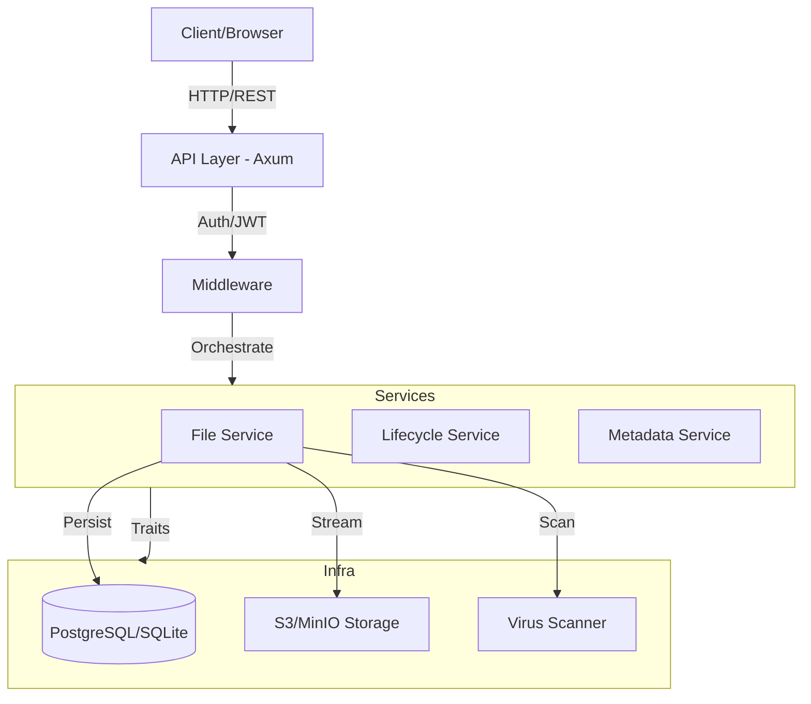

# Architecture Documentation

## 1. High-Level System Overview
The Rust File Backend is a high-performance, secure file management system designed for enterprise-grade scalability. It provides a robust API for file storage, retrieval, and organization with built-in security and optimization features.

### Primary Components:
*   **API Layer (Axum)**: Orchestrates HTTP requests, handles routing, and manages middleware (Auth, Rate Limiting, Tracing).
*   **Storage Layer (S3/MinIO)**: Abstracted storage interface supporting S3-compatible backends.
*   **Authentication/Authorization**: JWT-based security with user-scoped access control.
*   **File Streaming & Deduplication**: Efficiently handles large uploads via streaming and optimizes storage using SHA-256 content hashes.
*   **Virus Scanning Subsystem**: Pluggable scanning architecture (e.g., ClamAV) to ensure file safety before persistence.
*   **Metadata & Analysis**: Automatic technical metadata extraction (MIME, dimensions, EXIF) during the upload pipeline.
*   **Lifecycle Management**: Manages reference counting for deduplicated files and handles soft-deletion/cleanup.

---

## 2. Architectural Decisions

### Why Async / Tokio?
Chosen for its industry-standard performance in I/O-bound applications. Tokio allows the system to handle thousands of concurrent file streams with minimal memory overhead, which is critical for a file-heavy backend.

### Why SeaORM?
Provides a type-safe, async ORM that simplifies database interactions. It allows us to maintain a clean separation between database entities and business logic while supporting both PostgreSQL and SQLite.

### Streaming Multipart Upload
To support multi-gigabyte files on low-memory instances, the system implements a **buffer-free streaming pipeline**. Files are read from the HTTP multipart stream and passed directly to the S3 storage backend using multipart upload APIs.

### Content-Based Deduplication
Storage is optimized by using SHA-256 hashes as unique identifiers.
1.  File is uploaded to a temporary staging area.
2.  Hash is calculated during the stream.
3.  If the hash exists in the database, the new `user_file` simply points to the existing `storage_file` (incrementing a `ref_count`).
4.  If unique, the file is moved to permanent storage.

---

## 3. Key Invariants and Boundaries

*   **Domain Isolation**: `src/services` contains pure business logic. It is decoupled from the HTTP layer and should not depend on `axum` types.
*   **Infrastructure Decoupling**: Infrastructure components (DB, S3, Scanner) are accessed via traits. This ensures the system can be tested with mocks and allows for easy swapping of backends (e.g., moving from ClamAV to a different scanner).
*   **Thin Handlers**: HTTP handlers in `src/api` are responsible only for request parsing, service orchestration, and error mapping. They do not contain business logic.
*   **Storage Immutability**: Once a `storage_file` is written to the permanent bucket, it is immutable. Changes to file metadata or names only affect the `user_files` table.

---

## 4. System Diagram

---

## 5. Non-Functional Goals

### Resiliency
*   **Retries**: S3 operations and database connections implement exponential backoff.
*   **Graceful Degradation**: If the virus scanner is unavailable, the system can be configured to fail-closed (secure) or fail-open (development).

### Rate Limiting
Integrated `tower-governor` provides per-IP and per-user rate limiting to prevent DoS attacks and API abuse.

### Monitoring & Tracing
Full instrumentation using the `tracing` crate. Every request is assigned a unique ID, and logs are structured to allow easy correlation across services.

### Security Hardening
*   **Path Traversal Protection**: Filenames are strictly sanitized before storage.
*   **Magic Byte Validation**: File types are verified using content sniffing, not just file extensions.
*   **Soft Deletes**: User files are soft-deleted to prevent accidental data loss, while the underlying storage is cleaned up only when the last reference is removed.
