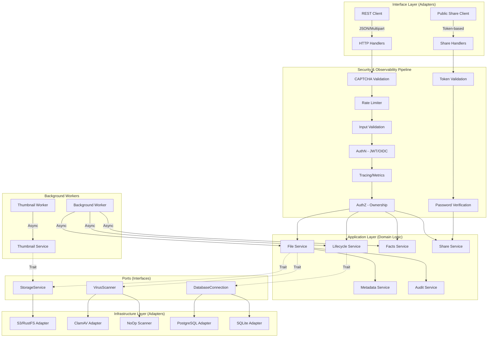

# Architecture Documentation

## 1. High-Level System Overview
The Rust File Backend is built on a **Hexagonal Architecture** (Ports and Adapters) to ensure strict separation between business logic and infrastructure. This design allows for high testability, maintainability, and the ability to swap infrastructure components without touching core domain logic.

### Explicit Architectural Layers:
*   **Domain Layer (`src/entities`)**: Contains the core data models (SeaORM entities) and business rules. This layer has zero dependencies on external libraries or other layers.
*   **Application Layer (`src/services`)**: Implements use cases (e.g., "Process Upload", "Delete Folder", "Create Share Link"). It orchestrates domain entities and interacts with infrastructure via **Ports (Traits)**.
*   **Ports / Interfaces**: Explicit traits (e.g., `StorageService`, `VirusScanner`) that define the contract for infrastructure.
*   **Infrastructure Layer (`src/infrastructure`)**: Concrete implementations of Ports (Adapters), such as `S3StorageService` (using `aws-sdk-s3`) or `ClamAVScanner`.
*   **Interface Layer (`src/api`)**: The entry point for the system. Handles HTTP/REST concerns, serialization, and maps errors to the outside world.
*   **Background Workers**: Async tasks for non-blocking operations like storage lifecycle cleanup, virus scanning, user statistics updates, and thumbnail generation.

---

## 2. Security Zones & Middleware Pipeline
Every request passes through a multi-stage security and observability pipeline before reaching the application layer.

| Zone | Component | Responsibility |
| :--- | :--- | :--- |
| **Zone 0: Bot Protection** | `CAPTCHA` | Protects registration and sensitive endpoints from automated bot attacks. |
| **Zone 1: Perimeter** | `CORS` / `Rate Limit` | Protects against unauthorized origins and DoS attacks. Configurable via `ALLOWED_ORIGINS`. |
| **Zone 2: Input Validation** | `Advanced Validation` | Entropy analysis (packed binary detection), Script Injection checks (XSS protection), MIME type verification, and Magic Byte analysis. |
| **Zone 3: AuthN** | `JWT Middleware` | Validates identity tokens and extracts `Claims`. Supports both local JWT and OIDC. Verified against DB. |
| **Zone 4: Observability** | `Tracing` / `Metrics` | Injects `Request-ID` and records latency/throughput metrics using `tracing`. |
| **Zone 5: AuthZ** | `Ownership Check` | Ensures users can only access or modify their own files/folders. |

**Note:** Public share endpoints (`/share/:token/*`) bypass Zones 3–5 and rely on token-based access with optional password verification.

---

## 3. Detailed System Diagram (Hexagonal)



---

## 4. Core Services

### File Service (`src/services/file_service.rs`)
The central orchestrator for all file operations:
- **Upload Processing**: Streaming upload to S3 ("staging"), hash calculation (`xxhash`), deduplication check, metadata extraction.
- **Advanced Validation**: Deep content inspection for entropy and malicious scripts (`validation.rs`).
- **Download**: Secure streaming with range request support (HTTP 206) for large files. Uses Nginx `X-Accel-Redirect` for presigned URL proxying.
- **Bulk Operations**: Atomic `bulk_delete`, `bulk_move`, and `bulk_copy` with transaction support.
- **Recursive Duplication**: `bulk_copy` implements an asynchronous recursive strategy to clone folder structures while maintaining reference counting for deduplicated physical storage.
- **Lifecycle**: Soft deletion with reference counting for deduplicated storage cleanup.
- **Favorites**: Toggle `is_favorite` flag on files and folders.
- **Folder Tree**: Returns all user folders for navigation tree construction.

### Share Service (`src/services/share_service.rs`)
Manages the file sharing lifecycle:
- **Token Generation**: Cryptographically secure URL-safe random tokens (24 bytes, base64-encoded).
- **Password Protection**: Argon2-hashed passwords with salt generation via `OsRng`.
- **Password Verification**: Secure constant-time comparison against stored Argon2 hashes.
- **Share CRUD**: Create, list, revoke share links with ownership verification.
- **Permission Model**: `view` (inline display) vs `download` (attachment Content-Disposition).
- **Share Types**: `public` (anyone with link) or `user` (specific user ID).
- **Expiration**: Configurable expiry up to 1 year; expired shares are auto-rejected.
- **Access Logging**: Records every view, download, password attempt, and folder listing with IP address and User-Agent.
- **File/Folder Queries**: Check if a file has active shares; list all shares for a specific file.

### Thumbnail Service (`src/services/thumbnail_service.rs`)
Generates optimized WebP thumbnails:
- **Image Thumbnails**: In-memory resize to 256×256 using `image` crate, encoded to WebP.
- **PDF Thumbnails**: Renders first page via `pdftocairo` (poppler-utils) to PNG, then re-encodes to WebP.
- **Video Thumbnails**: Extracts frame at 1-second mark via `ffmpeg`, resizes and encodes to WebP.
- **Encrypted File Detection**: Catches password-protected PDFs and flags `is_encrypted` on the storage file instead of failing.
- **Storage**: Thumbnails stored at `thumbnails/{storage_file_id}.webp` in S3/RustFS.

### Metadata Service (`src/services/metadata.rs`)
Extracts rich metadata from various file types:
- **Images**: Dimensions, EXIF data (using `image`, `kamadak-exif`).
- **Audio/Video**: Duration, Bitrate, ID3 tags (using `lofty`).
- **Documents**: Page counts, Authors (using `lopdf` for PDF, `zip`+`xml` for Office/OpenXML).
- **Text**: Line/Word counts.

### Background Worker (`src/services/worker.rs`)
Handles asynchronous maintenance tasks:
- **Virus Scanning**: Polls `pending` scans, streams from S3 to Scanner, updates DB.
- **Facts Update**: Periodically recalculates user storage usage (cached in `user_file_facts`).
- **Cleanup**:
    - Expires files past `expires_at`.
    - Removes infected files after grace period.
    - Cleans abandoned S3 staging files.

### Facts Service (`src/services/facts_service.rs`)
Computes and caches per-user storage statistics:
- Total file count and storage size.
- File type distribution (images, videos, documents, etc.).
- Cached for performance to avoid expensive aggregations on every request.

### Scanner Service (`src/services/scanner.rs` & `infrastructure/scanner.rs`)
Pluggable virus scanning interface:
- **ClamAVScanner**: Production scanner connecting via TCP/Unix socket.
- **NoOpScanner**: Development scanner that always passes.
- **AlwaysInfectedScanner**: Testing scanner for security validation.

### Audit Service (`src/services/audit.rs`)
Tracks security-relevant events:
- User registrations and logins.
- File uploads, deletions, and shared link generation.
- OIDC authentication events.

### CAPTCHA Service (`src/api/handlers/captcha.rs`)
Provides bot protection:
- **Challenge Generation**: Creates base64-encoded image challenges with encrypted text.
- **Validation**: Verifies user input against active challenges with expiration logic.
- **Cooldowns**: Implements per-IP cooldowns for failed attempts to mitigate brute-force attacks.

---

## 5. Security Hardening Measures

### Container Security
- **Non-Root User**: The Docker container runs as `appuser` (UID 10001) to follow the Principle of Least Privilege.
- **Minimal Base Image**: Uses `alpine 3.20` for a smaller attack surface.

### Advanced Input Validation (`src/utils/validation.rs`)
- **Entropy Analysis**: Calculates Shannon entropy of file headers to detect packed/encrypted executables masking as text/images (Trigger > 7.9).
- **Script Injection Detection**: Scans first 2KB of text/media files for XSS vectors (e.g., `<script>`, `javascript:`, `onerror=`).
- **Magic Bytes**: Strict file signature verification against MIME types.
- **Filename Sanitization**: Removes dangerous characters and control codes.

### Share Security
- **Token Entropy**: 24-byte random tokens (192 bits of entropy) make brute-forcing infeasible.
- **Password Hashing**: Argon2id with per-share random salt; never stored in plaintext.
- **Expiration Enforcement**: Server-side expiry check on every share access.
- **Infected File Blocking**: Downloads blocked for files with `scan_status = "infected"`, even via share links.
- **Content-Disposition Control**: `view` permission forces `inline` display; `download` forces `attachment`.

### Header Security
- **CORS**: Configurable `Access-Control-Allow-Origin`.
- **HSTS / Content-Security-Policy**: (Recommended for production deployment via reverse proxy).

---

## 6. Infrastructure Details

### Storage (`src/infrastructure/storage.rs`)
- **S3 Compatible**: Works with AWS S3, RustFS, MinIO, Cloudflare R2.
- **Multipart Uploads**: Handles large files by splitting them into chunks (default 10MB).
- **Streaming**: Never loads entire file into memory; pipes `AsyncRead` -> `S3 Stream`.
- **Presigned URLs**: Generates time-limited presigned URLs for secure download via Nginx `X-Accel-Redirect`.

### Cache & Queue (`src/infrastructure/cache.rs` - planned/internal)
- **Redis**: Used for rate limiting tokens, CAPTCHA sessions, and temporary facts caching.
- **Connection Pool**: Managed via `bb8` or `fred` (depending on implementation state).

### Database
- **SeaORM**: Async ORM for type-safe interactions.
- **Migrations**: Managed via `migration` crate (run via `--mode migrate`).
- **Connection Pooling**: Built-in via `sqlx`.

---

## 7. Data Models

### Core Entities (`src/entities`)
| Entity | Description |
|--------|-------------|
| `users` | User accounts with authentication data |
| `user_files` | User's file/folder references (virtual filesystem) with favorite flag |
| `storage_files` | Physical file storage with deduplication, thumbnail tracking, encrypted flag |
| `file_metadata` | Extracted metadata (EXIF, document info, etc.) |
| `file_tags` | User-defined tags for organization |
| `tags` | Tag definitions |
| `user_settings` | Per-user preferences (theme, view style) |
| `user_file_facts` | Cached storage statistics |
| `share_links` | Share link records (token, type, permission, password hash, expiry) |
| `share_access_logs` | Access audit trail for share links (IP, User-Agent, action) |
| `upload_sessions` | In-progress chunked upload tracking |
| `audit_logs` | Security event audit trail |
| `tokens` | JWT token tracking |

### Deduplication Model
```
User A uploads file.pdf (hash: abc123)
  └── user_files: id=1, user_id=A, storage_file_id=X
  └── storage_files: id=X, hash=abc123, ref_count=1

User B uploads same file (hash: abc123)
  └── user_files: id=2, user_id=B, storage_file_id=X
  └── storage_files: id=X, hash=abc123, ref_count=2 (incremented)
```

### Share Model
```
User A shares file.pdf
  └── share_links: id=S1, user_file_id=1, token=abc123xyz,
      share_type=public, permission=download, password_hash=...,
      expires_at=2026-03-01T00:00:00Z

Public access via /share/abc123xyz
  └── share_access_logs: share_link_id=S1, action=view,
      ip_address=1.2.3.4, user_agent=Mozilla/...
```

### Thumbnail Model
```
storage_files: id=X, has_thumbnail=true, is_encrypted=false
  └── S3 key: thumbnails/X.webp (256px WebP)
```

---

## 8. Architectural Invariants (The "Golden Rules")

1.  **No Direct Infra Access**: Services **must not** instantiate concrete infrastructure types (e.g., `S3Client`). They must receive `Arc<dyn Port>`.
2.  **Statelessness**: The API layer is completely stateless. All state is persisted in the Database or S3.
3.  **Unidirectional Dependencies**: Dependencies always point inward. Infrastructure depends on Ports; Ports depend on Domain. Domain depends on nothing.
4.  **Streaming First**: All file operations must use `AsyncRead`/`AsyncWrite` to maintain a constant memory footprint regardless of file size.
5.  **Soft Deletion**: Files are never immediately purged. Reference counting ensures shared storage is cleaned up only when all references are removed.
6.  **Share Isolation**: Public share endpoints must never expose internal IDs (user_id, storage_file_id) to external clients.

---

## 9. Deployment & Release (v1.1.0)

### Tri-Mode Operation

| Mode | Command | Description |
|------|---------|-------------|
| API | `--mode api` | HTTP server for all REST endpoints |
| Worker | `--mode worker` | Background tasks: scanning, cleanup, facts |
| Thumbnail Worker | `--mode thumbnail-worker` | WebP thumbnail generation |
| Migrate | `--mode migrate` | Run database migrations |
| All | `--mode all` | Combined API + Worker (default) |

### Docker Compose Services

| Service | Image | Purpose |
|---------|-------|---------|
| `api` | `rfb-api` | Axum HTTP server |
| `worker` | `rfb-api` (worker mode) | Background processing |
| `thumbnail-worker` | `rfb-api` (thumbnail-worker mode) | Thumbnail generation |
| `db` | `postgres:15-alpine` | Database |
| `rustfs` | `rustfs/rustfs` | S3-compatible storage |
| `web` | `rfb-web` | Nginx + React frontend |

### Release Checklist:
1.  **Version Check**: Ensure `Cargo.toml` and `package.json` reflect `1.1.0`.
2.  **Migrations**: Verify all `migration` files are committed (including `share_links`, `share_access_logs`, and storage_files columns).
3.  **Security Audit**: Run `cargo audit` and `bun audit`.
4.  **Static Analysis**: Ensure `cargo clippy` and `bun run lint` pass.
5.  **Documentation**: Update `RELEASE_NOTES.md` and OpenAPI spec.
6.  **Environment**: Update `.env.sample` with any new variables (e.g., CAPTCHA config).
7.  **Thumbnails**: Ensure `pdftocairo` and `ffmpeg` are available in the Docker image if thumbnail generation is needed.
