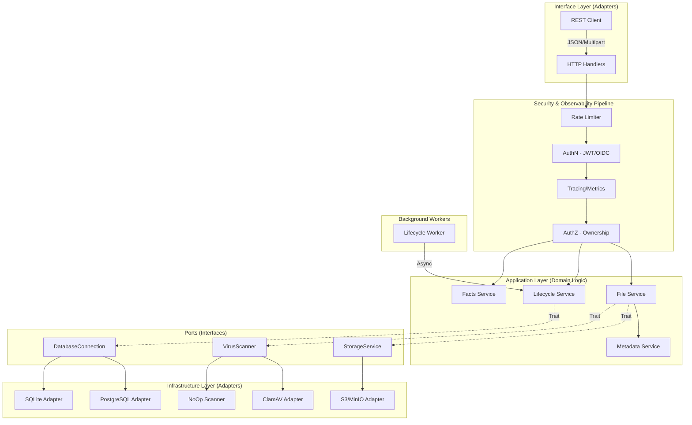

# Architecture Documentation

## 1. High-Level System Overview
The Rust File Backend is built on a **Hexagonal Architecture** (Ports and Adapters) to ensure strict separation between business logic and infrastructure. This design allows for high testability, maintainability, and the ability to swap infrastructure components without touching core domain logic.

### Explicit Architectural Layers:
*   **Domain Layer (`src/entities`)**: Contains the core data models and business rules. This layer has zero dependencies on external libraries or other layers.
*   **Application Layer (`src/services`)**: Implements use cases (e.g., "Process Upload", "Delete Folder"). It orchestrates domain entities and interacts with infrastructure via **Ports (Traits)**.
*   **Ports / Interfaces**: Explicit traits (e.g., `StorageService`, `VirusScanner`) that define the contract for infrastructure.
*   **Infrastructure Layer (`src/infrastructure`)**: Concrete implementations of Ports (Adapters), such as `S3StorageService` or `ClamAVScanner`.
*   **Interface Layer (`src/api`)**: The entry point for the system. Handles HTTP/REST concerns, serialization, and maps errors to the outside world.
*   **Background Workers**: Async tasks for non-blocking operations like storage lifecycle cleanup and scheduled retention jobs.

---

## 2. Security Zones & Middleware Pipeline
Every request passes through a multi-stage security and observability pipeline before reaching the application layer.

| Zone | Component | Responsibility |
| :--- | :--- | :--- |
| **Zone 1: Perimeter** | `CORS` / `Rate Limit` | Protects against unauthorized origins and DoS attacks. |
| **Zone 2: AuthN** | `JWT Middleware` | Validates identity tokens and extracts `Claims`. Supports both local JWT and OIDC. |
| **Zone 3: Observability** | `Tracing` / `Metrics` | Injects `Request-ID` and records latency/throughput metrics. |
| **Zone 4: AuthZ** | `Ownership Check` | Ensures users can only access or modify their own files/folders. |

---

## 3. Detailed System Diagram (Hexagonal)



---

## 4. Core Services

### File Service (`src/services/file_service.rs`)
The central orchestrator for all file operations:
- **Upload Processing**: Streaming upload, hash calculation, deduplication check, virus scanning, metadata extraction.
- **Download**: Secure streaming with range request support for large files.
- **Lifecycle**: Soft deletion with reference counting for deduplicated storage cleanup.

### Facts Service (`src/services/facts_service.rs`)
Computes and caches per-user storage statistics:
- Total file count and storage size
- File type distribution (images, videos, documents, etc.)
- Cached with 10-second TTL for performance

### Scanner Service (`src/services/scanner.rs`)
Pluggable virus scanning interface:
- **ClamAVScanner**: Production scanner connecting via TCP/Unix socket
- **NoOpScanner**: Development scanner that always passes
- **AlwaysInfectedScanner**: Testing scanner for security validation

### Audit Service (`src/services/audit.rs`)
Tracks security-relevant events:
- User registrations and logins
- File uploads and deletions
- OIDC authentication events

---

## 5. API Handler Groups

### Authentication (`src/api/handlers/auth.rs`)
- `register`: Create new user with Argon2 password hashing
- `login`: Authenticate and issue JWT token
- `login_oidc`: Initiate OpenID Connect flow
- `callback_oidc`: Handle OIDC provider callback

### Files (`src/api/handlers/files.rs`)
- `upload_file`: Multipart upload with streaming
- `pre_check_dedup`: Client-side deduplication check
- `link_file`: Link to existing storage (skip upload)
- `list_files`: Paginated listing with search/filter
- `download_file`: Secure file download with range support
- `create_folder`: Create new directory
- `delete_item`: Soft delete file/folder
- `rename_item`: Rename file/folder, with folder restructuring
- `bulk_delete`: Delete multiple items
- `bulk_move`: Move multiple items to new parent
- `get_zip_contents`: Preview archive contents
- `generate_download_ticket`: Create time-limited download link
- `download_file_with_ticket`: Public download via ticket

### Users (`src/api/handlers/users.rs`)
- `get_profile`: Retrieve user information
- `update_profile`: Update email, name, password
- `upload_avatar`: Upload profile picture
- `get_avatar`: Retrieve profile picture
- `get_user_facts`: Get storage statistics

### Settings (`src/api/handlers/user_settings.rs`)
- `get_settings`: Retrieve theme and view preferences
- `update_settings`: Update user preferences

### Health (`src/api/handlers/health.rs`)
- `health_check`: Database and storage connectivity status

---

## 6. Data Models

### Core Entities
| Entity | Description |
|--------|-------------|
| `users` | User accounts with authentication data |
| `user_files` | User's file/folder references (virtual filesystem) |
| `storage_files` | Physical file storage with deduplication |
| `file_metadata` | Extracted metadata (EXIF, document info, etc.) |
| `file_tags` | User-defined tags for organization |
| `user_settings` | Per-user preferences (theme, view style) |
| `user_file_facts` | Cached storage statistics |

### Deduplication Model
```
User A uploads file.pdf (hash: abc123)
  └── user_files: id=1, user_id=A, storage_file_id=X
  └── storage_files: id=X, hash=abc123, ref_count=1

User B uploads same file (hash: abc123)
  └── user_files: id=2, user_id=B, storage_file_id=X
  └── storage_files: id=X, hash=abc123, ref_count=2 (incremented)
```

---

## 7. Cross-Cutting Concerns

### Config & Secrets Management
*   **Environment-Based**: Configuration is loaded via `dotenvy` and mapped to a strongly-typed `SecurityConfig` struct.
*   **Secret Masking**: Sensitive values (JWT secrets, S3 keys) are never logged.

### Tracing & Observability
*   **Structured Logging**: Uses `tracing-subscriber` with JSON output for ELK/Loki compatibility.
*   **Span Propagation**: Spans track a file from the initial multipart chunk read to the final S3 commit.

### Error Handling
*   **Typed Errors**: `AppError` enum with variants for BadRequest, Unauthorized, NotFound, Forbidden, Internal.
*   **Consistent Responses**: All errors return structured JSON with appropriate HTTP status codes.

---

## 8. Architectural Invariants (The "Golden Rules")

1.  **No Direct Infra Access**: Services **must not** instantiate concrete infrastructure types (e.g., `S3Client`). They must receive `Arc<dyn Port>`.
2.  **Statelessness**: The API layer is completely stateless. All state is persisted in the Infrastructure layer.
3.  **Unidirectional Dependencies**: Dependencies always point inward. Infrastructure depends on Ports; Ports depend on Domain. Domain depends on nothing.
4.  **Streaming First**: All file operations must use `AsyncRead`/`AsyncWrite` to maintain a constant memory footprint regardless of file size.
5.  **Soft Deletion**: Files are never immediately purged. Reference counting ensures shared storage is cleaned up only when all references are removed.
