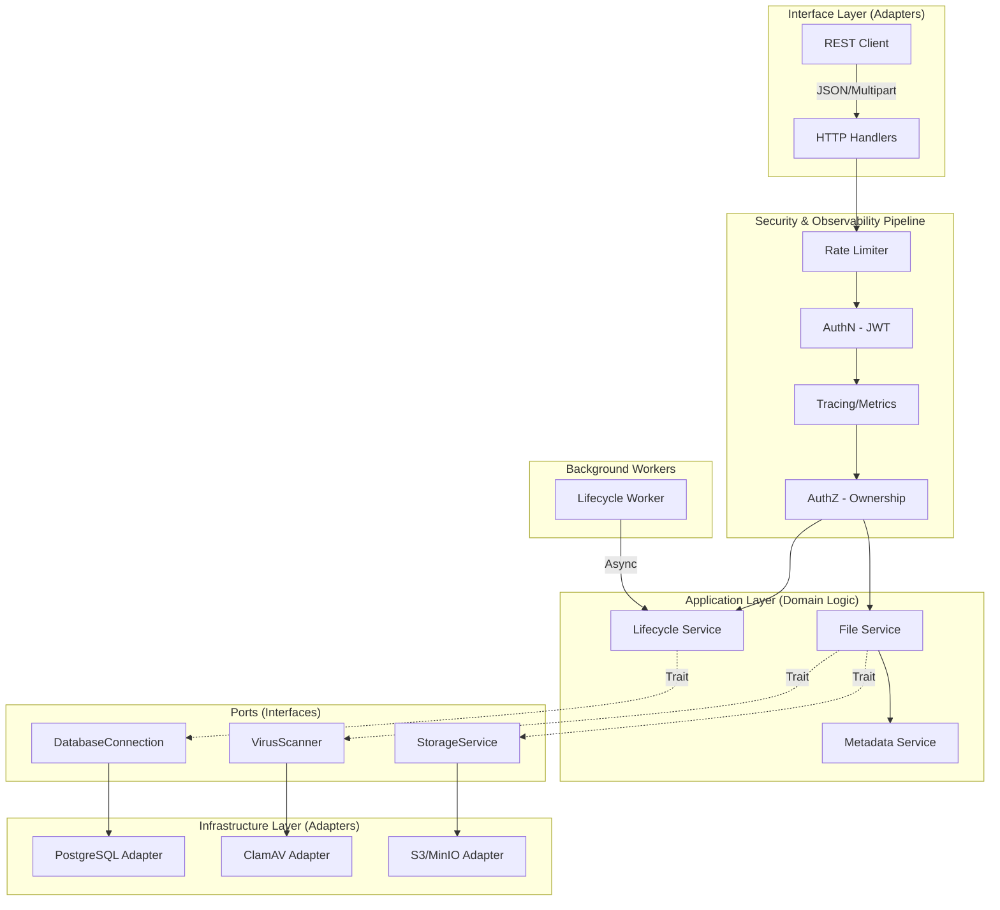

# Architecture Documentation

## 1. High-Level System Overview
The Rust File Backend is built on a **Hexagonal Architecture** (Ports and Adapters) to ensure strict separation between business logic and infrastructure. This design allows for high testability, maintainability, and the ability to swap infrastructure components without touching core domain logic.

### Explicit Architectural Layers:
*   **Domain Layer (`src/entities`)**: Contains the core data models and business rules. This layer has zero dependencies on external libraries or other layers.
*   **Application Layer (`src/services`)**: Implements use cases (e.g., "Process Upload", "Delete Folder"). It orchestrates domain entities and interacts with infrastructure via **Ports (Traits)**.
*   **Ports / Interfaces**: Explicit traits (e.g., `StorageService`, `VirusScanner`) that define the contract for infrastructure.
*   **Infrastructure Layer (`src/infrastructure`)**: Concrete implementations of Ports (Adapters), such as `S3StorageService` or `ClamAVScanner`.
*   **Interface Layer (`src/api`)**: The entry point for the system. Handles HTTP/REST concerns, serialization, and maps errors to the outside world.
*   **Background Workers**: Async tasks for non-blocking operations like storage lifecycle cleanup and scheduled retention jobs.

---

## 2. Security Zones & Middleware Pipeline
Every request passes through a multi-stage security and observability pipeline before reaching the application layer.

| Zone | Component | Responsibility |
| :--- | :--- | :--- |
| **Zone 1: Perimeter** | `CORS` / `Rate Limit` | Protects against unauthorized origins and DoS attacks (via `tower-governor`). |
| **Zone 2: AuthN** | `JWT Middleware` | Validates identity tokens and extracts `Claims`. |
| **Zone 3: Observability** | `Tracing` / `Metrics` | Injects `Request-ID` and records latency/throughput metrics. |
| **Zone 4: AuthZ** | `Ownership Check` | Ensures users can only access or modify their own files/folders. |

---

## 3. Detailed System Diagram (Hexagonal)

---

## 4. Async & Event-Driven Components

### Virus Scanning Pipeline
Scanning is handled as a critical step in the upload pipeline but is designed to be pluggable.
*   **Sync-over-Async**: The `FileService` awaits the `VirusScanner` port.
*   **Pluggable Adapters**: In development, a `NoOpScanner` is used; in production, a `ClamAVScanner` communicates over TCP/Unix sockets to a dedicated scanning cluster.

### Storage Lifecycle & Cleanup
The system uses a **Reference Counting** mechanism to manage deduplicated storage.
*   **Soft Deletion**: `DELETE` requests only mark `user_files` as deleted.
*   **Async Cleanup**: A background process (or triggered task) decrements `ref_count` on `storage_files`. When `ref_count == 0`, the physical file is purged from S3/MinIO asynchronously to ensure low latency for the user.

---

## 5. Cross-Cutting Concerns

### Config & Secrets Management
*   **Environment-Based**: Configuration is loaded via `dotenvy` and mapped to a strongly-typed `Config` struct.
*   **Secret Masking**: Sensitive values (JWT secrets, S3 keys) are never logged and are stored in memory using `Arc<Config>`.

### Tracing & Observability
*   **Structured Logging**: Uses `tracing-subscriber` with JSON output for ELK/Loki compatibility.
*   **Span Propagation**: Spans track a file from the initial multipart chunk read to the final S3 commit, providing deep visibility into performance bottlenecks.

### Metrics
*   **Business Metrics**: Tracks total storage used, deduplication ratio, and virus detection rates.
*   **Technical Metrics**: Tracks HTTP 5xx rates, S3 latency, and database pool utilization.

---

## 6. Architectural Invariants (The "Golden Rules")

1.  **No Direct Infra Access**: Services **must not** instantiate concrete infrastructure types (e.g., `S3Client`). They must receive `Arc<dyn Port>`.
2.  **Statelessness**: The API layer is completely stateless. All state is persisted in the Infrastructure layer.
3.  **Unidirectional Dependencies**: Dependencies always point inward. Infrastructure depends on Ports; Ports depend on Domain. Domain depends on nothing.
4.  **Streaming First**: All file operations must use `AsyncRead`/`AsyncWrite` to maintain a constant memory footprint regardless of file size.
